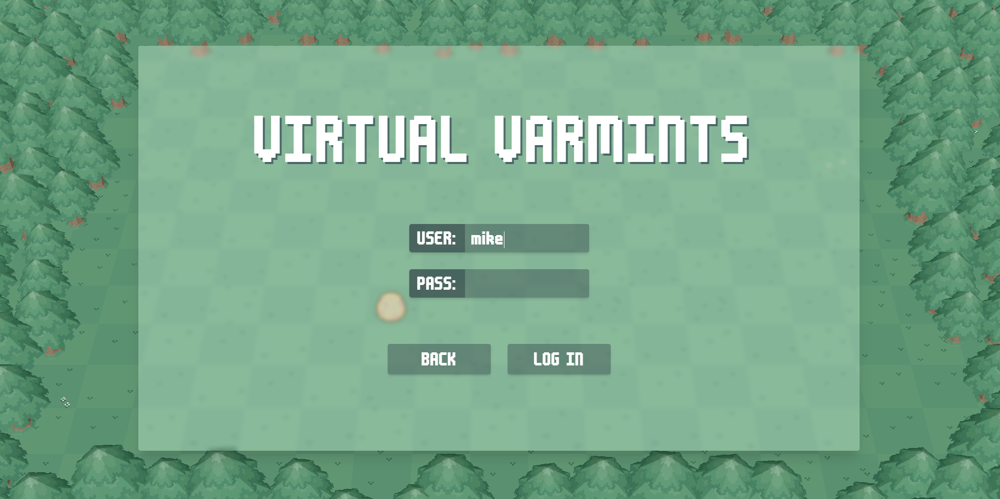
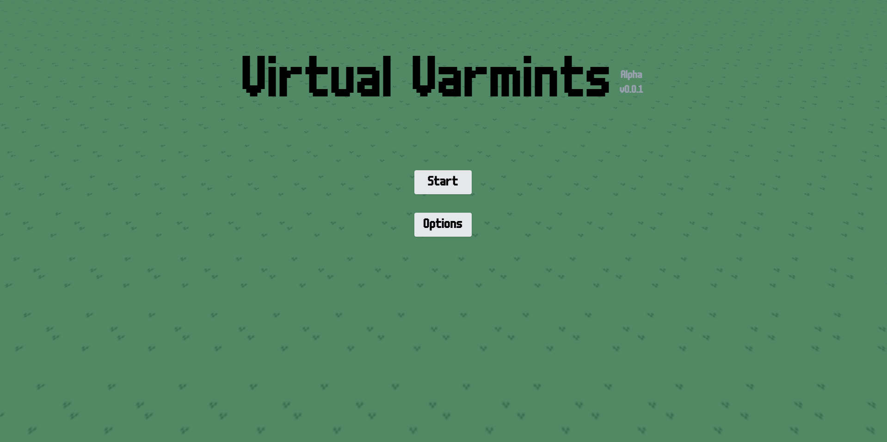
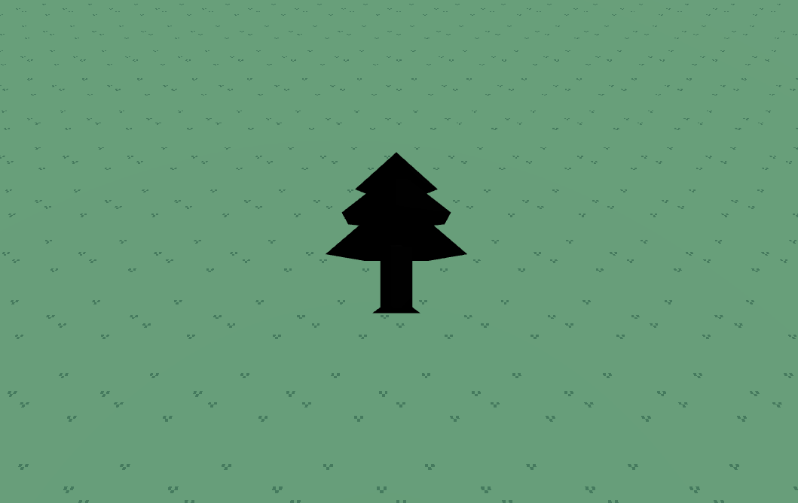
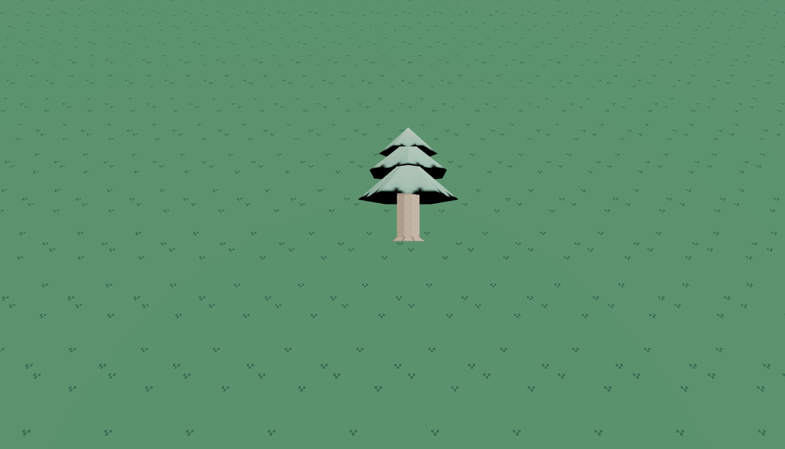
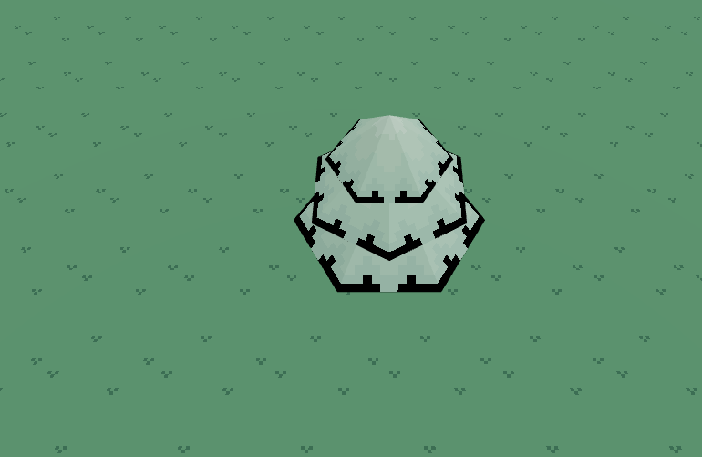
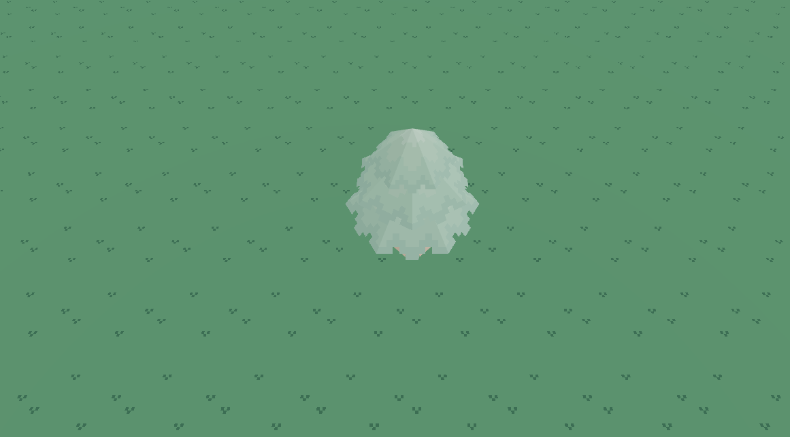
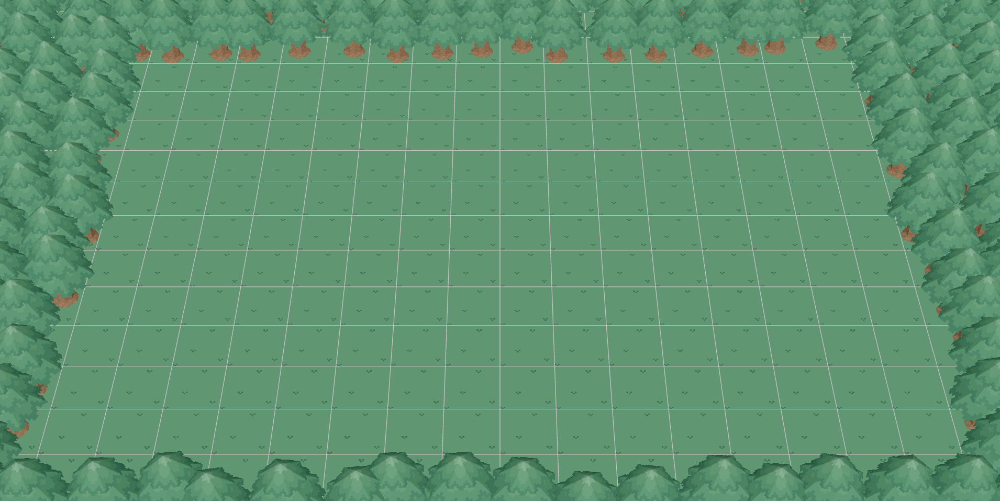

# VIRTUAL VARMINTS WEB APPLICATION v0.0.1 ALPHA

This is intended to be a continuation of bitbeast arena, reimagined as an in-browser virtual pet game a la the style of Neopets.

We're very much in the early stages here, but let's see how it goes!

Progress as of 3/10/25

Progress as of 2/27/25

Progress as of 2/26/25

## Tech Stack
- React
- Vite
- React Three Fiber (with react-three/drei)
- TailwindCSS
- Flask
- SQLAlchemy (with SQLite)
- Flask-CORS

## 3D trees r3f rendering progress

