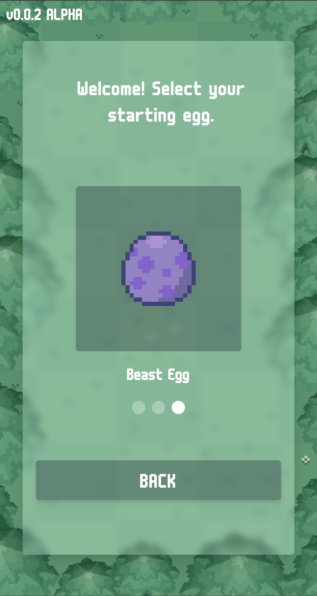
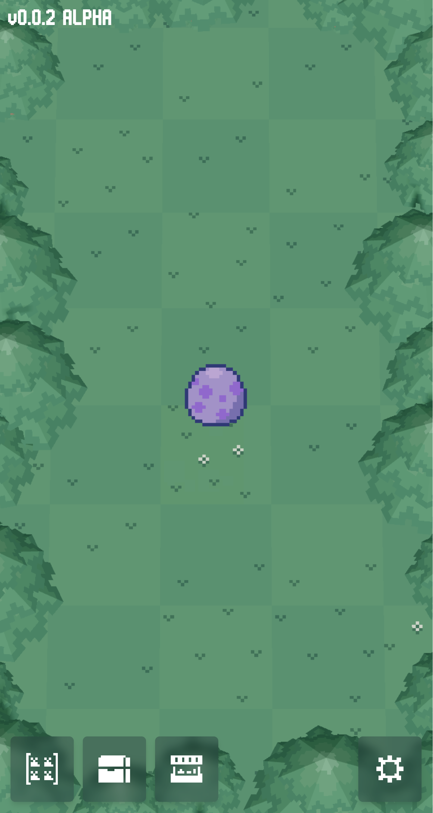
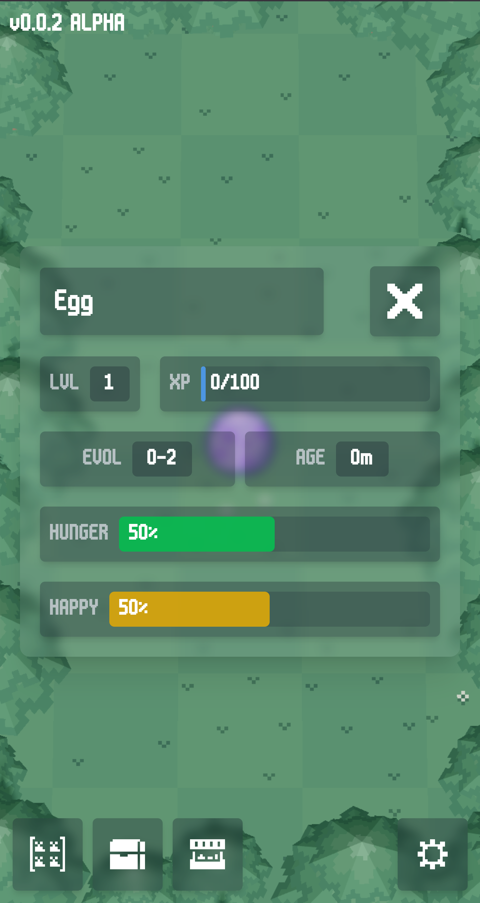

# WEBPETS WEB APPLICATION v0.0.2 ALPHA

This is intended to be a continuation of bitbeast arena, reimagined as a MOBILE in-browser virtual pet game. I'm not sure where exactly this thing will end up. A little bit of neopets, a lot of tamagotchi, some digimon. 

We're very much in the early stages here still, but I'm stoked about the accessibility of web dev.

## Targets before v0.0.3
* [ ] Egg hatching & animation
* [ ] Bug Fixes
    * [ ] Name update bug
    * [ ] Element size responsiveness on various devices
* [ ] Happiness, hunger degradation
* [ ] Feeding
* [ ] Pet metabolism (pooping!!!)

## Dev Log-ish

Oops, abandoned for a bit. Serves me right for getting a real job.
Picked back up though- mobile style. 6/24/25

Progress as of 3/10/25

Progress as of 2/27/25

Progress as of 2/26/25

## Tech Stack
- React
- Vite
- React Three Fiber (with react-three/drei)
- TailwindCSS
- Flask
- SQLAlchemy (with SQLite)
- Flask-CORS

## 3D trees r3f rendering progress

